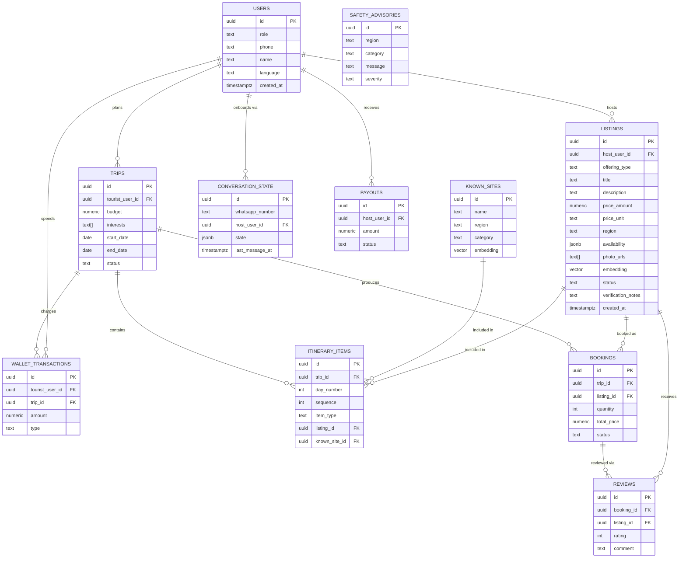

# Atithya — Backend Schema

**Companion to [[TRD]]** · PostgreSQL 16 + `pgvector`, accessed with the `pg` driver over raw parameterised SQL · Single init schema (no production data yet, so no expand-contract/zero-downtime ceremony — see `ponytail` note below).

> This is the first migration for a project with no prod data, so every column can be added with real constraints up front instead of the nullable-then-backfill dance zero-downtime migrations need. That pattern is documented in `docs/BACKEND_SCHEMA.md#phase-2-migration-notes` for when the schema needs to change under live data.

## 1. Entity-Relationship Diagram

## 2. Design Notes

- **One `users` table with a `role` enum** rather than separate host/tourist/gov tables — a real person could plausibly be both a tourist and a host, and splitting identity from role-specific data avoids a duplicate-identity problem later. Role-specific fields live on the tables that actually need them (`listings.host_user_id`, `trips.tourist_user_id`), not on `users` itself.
- **`listings.embedding` (pgvector)** powers the Planning Agent's semantic retrieval (`retrieve_candidates` node in [[TRD]] §3.2) — cosine similarity against the tourist's stated interests.
- **No separate `pricing_suggestions` table.** The AI pricing copilot (`GET /api/v1/hosts/:id/pricing-suggestions`) computes a suggestion live from `listings` + `bookings` (regional median price for the same `offering_type`/`region`) — storing it would just be a cache with nothing yet to invalidate against. Add a table only if computing it live becomes measurably slow.
- **No separate `gov_metrics` table.** The government dashboard's heatmap and scheme metrics are aggregate `GROUP BY` queries over `bookings`/`listings`/`reviews` — same reasoning as above.
- **`conversation_state` maps a WhatsApp number to a host**, and records when they last wrote. It does *not* hold the half-finished listing: that draft lives in the onboarding graph's checkpoint (`PostgresSaver`, thread id = the number), so there is exactly one copy of it. `state` is `jsonb` for the few pointers worth querying in SQL (e.g. `last_listing_id`) without a migration each time the graph changes.
- **Mock money, real ledger shape.** `wallet_transactions` and `payouts` are structured exactly like a real ledger (append-only, typed) even though no payment gateway is wired up — swapping in Razorpay/Stripe later is an integration change, not a schema change.

## 3. `schema.sql`

**The DDL lives in [`server/src/db/schema.sql`](../server/src/db/schema.sql), not here.** It is applied verbatim by `npm run db:init`, so it is the migration, and a second copy in this document would only drift from it. The ERD in §1 is the diagram of that file; read the file for the exact columns.

Three deliberate differences from the ERD's shorthand:

- `CREATE EXTENSION vector` — the pgvector extension is named `vector`; `CREATE EXTENSION pgvector` fails.
- `gen_random_uuid()` for every primary key, not `uuid-ossp`'s `uuid_generate_v4()` — built into PG13+, one less extension to install on whatever Postgres the demo runs against.
- `users` carries `username` and `password` (scrypt, `salt:hash`) on top of the ERD's identity columns — the 3 demo role accounts have to authenticate somehow (docs/TRD.md §4). WhatsApp-onboarded hosts get a non-hash placeholder, so they own a listing without being able to log in until a real credential is set.

## 4. Data Access (Node.js)

`schema.sql` above is not a design reference any more — it is the migration. `npm run db:init` pipes it straight into Postgres, so there is no second source of truth to drift from and no ORM mapping layer to keep in sync with the ERD.

- **No ORM.** Eleven tables, frozen for the build, queried by hand-written SQL through a single `pg.Pool` (`src/db.js`). Prisma would add a schema DSL, a generate step and a migration history for a database that gets created exactly once — and its pgvector support is still preview-only, which is the one column an ORM would actually have to earn.
- **Every query is parameterised** (`$1, $2, ...`), no string interpolation into SQL, ever. This is the only injection defence in the stack now that there is no ORM escaping values.
- **Enums stay in Postgres.** The `CREATE TYPE ... AS ENUM` blocks in §3 are the enum definition; the JS side mirrors them as frozen plain objects in `src/constants.js` so a typo is a runtime error at the boundary rather than a silent `22P02` from the driver.
- **`vector(1536)` values** are bound as a string literal (`'[0.1,0.2,...]'`) — `pgvector/pg` registers the type so arrays round-trip, but the query itself stays plain SQL.
- **`TEXT[]` maps to a JS array** natively via `pg`; `JSONB` maps to a plain object. No serialisation helpers needed for either.

## 5. Seed Data Needed for the Demo (not schema, but required to make the 3 dashboards non-empty on stage)

- 15–20 `known_sites` rows across 2–3 regions (so the itinerary isn't 100% agent-onboarded content).
- 5–10 pre-onboarded `listings` (so the tourist flow has inventory even before the live on-stage onboarding happens) + the live one onboarded during the demo.
- 20–30 historical `bookings`/`reviews` rows dated over the past few months (so the government dashboard's trend charts aren't a flat line).
- A handful of `safety_advisories` for the regions used in the demo itinerary.
- Write seed data as a node script (`npm run db:seed`) that inserts through the same `pg` pool the API uses, so a seed row and an API-created row go down the identical path — and re-running it is idempotent (truncate-then-insert), because it will be re-run on stage between rehearsals.

## 6. Phase-2 Migration Notes

Once this is running with real users, schema changes follow the standard expand-contract pattern (add nullable → backfill → switch reads → drop old column), with `CREATE INDEX CONCURRENTLY` for any index added to a table that already has production rows. None of that applies to this initial migration because the table doesn't exist yet to lock.
